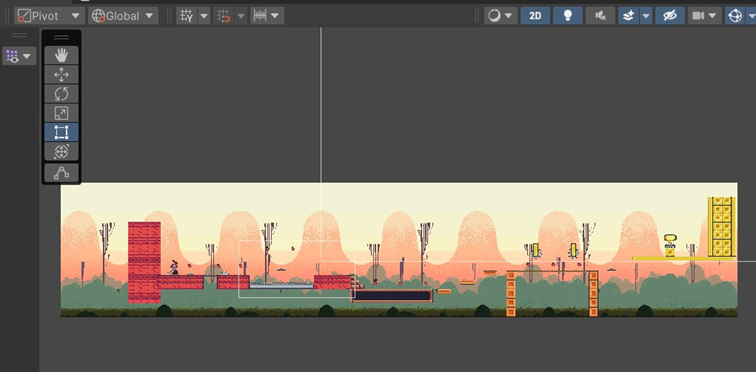
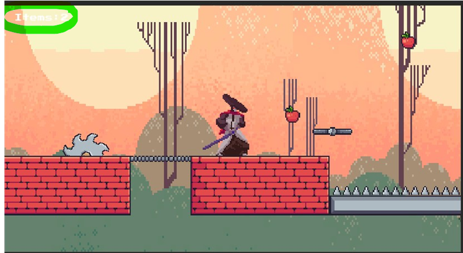
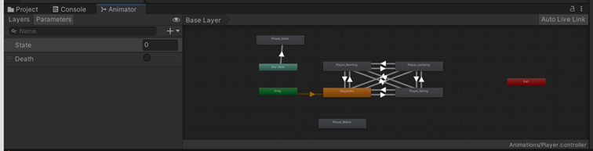

# PlatformerGame2D
2D Platformer Game made with Unity

The character in the game has to try to avoid traps, enemies and falling into death and must try to reach the finish line at the end of each stage. Character must collect items as much as it can and the number of collected items will show up on the left bottom. There is a health system in the game for the player and enemies, so that they are attacked few times before getting killed. 
Even though the game has only one stage, it is possible to create more stages in between.

#Project details

There are Player, Enemy Traps that kills the player,  Items that player will pick, platforms that moving side to side and finish line when the level is completed.

#The scripts:
•	Camera Controller: Makes camera to follow the player during the game.

•	Item Collector: Makes player to pick up the items and count how many is collected.

•	Player Movement: Gives the control to the player (jump, walk, death..) 

•	Player Status: Player’s life status when it hits dangerous objects and dies.

•	Rotate: Gives rotating motion to the saws.

•	WayPoint: Makes moving platform travel from one point to another.

•	Sticky platform: If this script does not exist, player would slide from the moving platform.

•	StartMenu: Starting menu

#Animations:
Each character has different animations and movements. 
We use animation and animator system of Unity and each object has its own Animation uniquely.

 

•	The player has jump, fall, walk, death animation.

•	Apple has its idle animation.

•	Bat has a flying animation.
